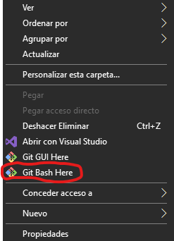
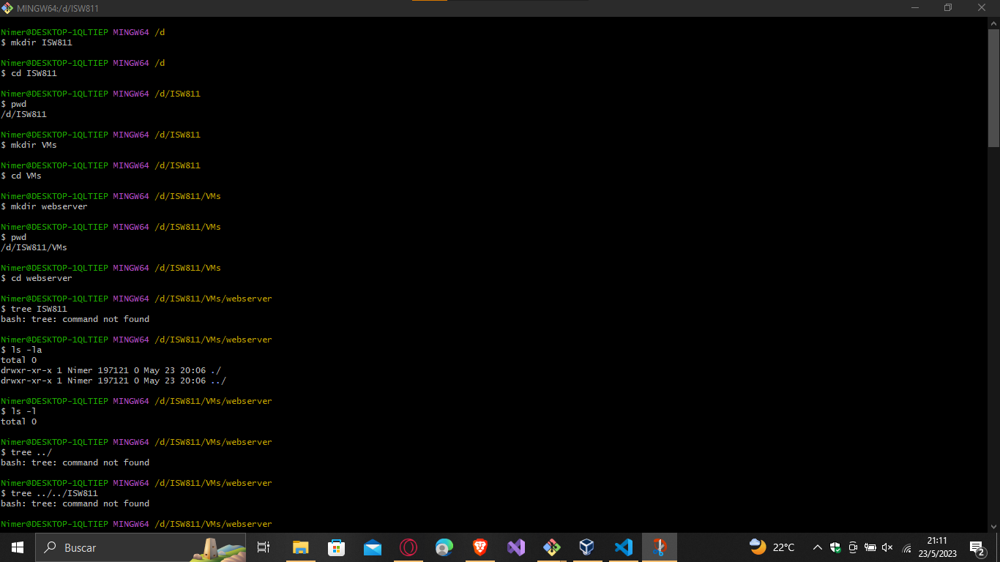
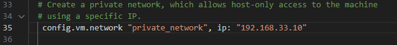
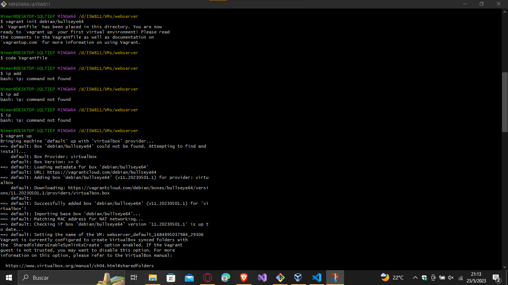
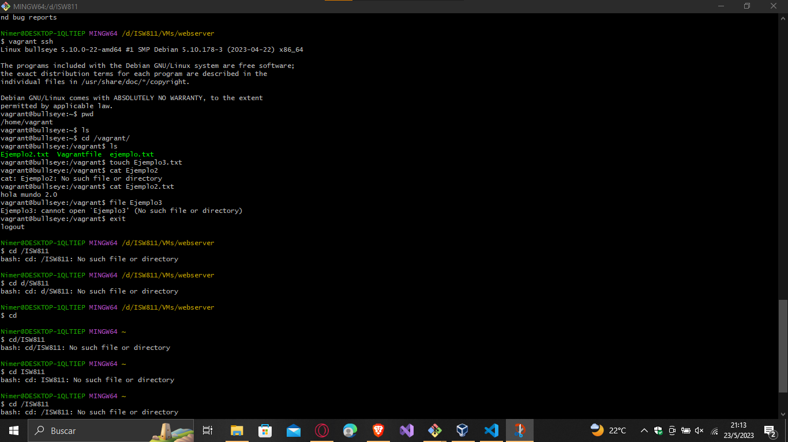

# How to create a virtual workspace in Windows

## 1 Download VirtualBox

To download VirtualBox, you can go to the following link:

[Download VirtualBox Here](https://www.virtualbox.org/wiki/Downloads)

## 2 Download Vagrant

To download Vagrant, you can go to the following link: 

[Download Vagrant Here](https://www.vagrantup.com/downloads)

Install the version of your operating system.

## 3 Download Git

To download Git, you can go to the following link: 

[Dowload Git Here](https://git-scm.com/download/win)

## 4 Download a text editor

Download a text editor of your choice, I recommend Visual Studio Code.

[Dowload Visual Studio Code Here](https://code.visualstudio.com/)

## 5 Move between folders
You have to open a cmd or gitBash terminal, to do it this way you just have to right click on a folder or on the desktop and the terminal will open.



### 5.1 CMD commands:
1. I recommend working in the home folder.
```cmd
    cd C:\Home  
```
2. Once in the selected folder, we are going to create another folder with the name ISW811 (it can be different).
```cmd
    mkdir ISW811  
```
3. We access a created folder.
```cmd
    cd ISW811  
```
4. We create another folder called VMs.
```cmd
    mkdir VMs  
```
5. We access a created folder.
```cmd
    cd VMs  
```
6. We create another folder called, with the name of your project.
```cmd
    mkdir webserver  
```
7. We access a created folder.
```cmd
    cd webserver  
```
### In the next part you can see an image with process


## 6 Create a virtual workspace
To create a virtual workspace, you need to enter the web server folder, created earlier.

### 6.1 Start vagrant with its respective operating system, to create the virtual space
command
```cmd
    vagrant init debian/bullseye64  
```
### 6.2 You need to edit the code that was created in the above command.
This command will open the Visual Studio code, you just have to uncomment line 35.
command
```cmd
    code Vagranfile 
```
like what you see in the following image



### 6.3 The following command configures the machine, to be able to start it.
```cmd
    vagrant up
```

### It has to stay as follows



### 6.4 The following command starts the machine.
```cmd
    vagrant ssh
```
Another terminal will open but this time from the virtual machine, which will be your workspace.
### It has to stay as follows


### 6.5 To close the machine you can do it with the following command

First log out of the virtual machine
```cmd
    exit
```
Once you are back in the console run the following command
```cmd
    vagrant halt
```
### To start the machine again, execute the following commands
```cmd
    vagrant up

    vagrant ssh
```


